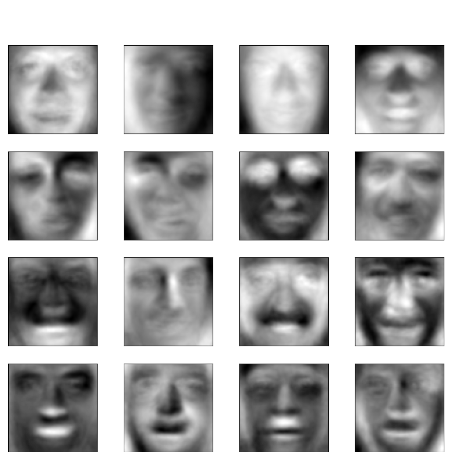

# Visualizing Linear Algebra
>Linear algebra is the study of lines and planes, vector spaces.Linear algebra is about linear combinations. That is, using arithmetic on columns of numbers called vectors and arrays of numbers called matrices, to create new columns and arrays of numbers. Linear algebra is the study of lines and planes, vector spaces and mappings that are required for linear transforms.
## 👥 Contributors

- [**Tushar Mali**](https://github.com/7-USH) - tush1245@gmail.com

- [**Soumitra Kand**](https://github.com/soumitrakand7/) - soumitrakand3@gmail.com


## 📄 Description
> Animating technical concepts is traditionally pretty tedious since it can be difficult to make the animations precise enough to convey them accurately. Manim relies on Python’s simplicity to generate animations programmatically, making it convenient to specify exactly how each one should run. Take a look at the Example Gallery for some inspiration on how to create beautiful images and videos with Manim.

- Refer to [**3b1b/manim**](https://github.com/3b1b/manim) for more details about manim engine.


# 👨 Eigen Faces
 - An eigenface is the name given to a set of eigenvectors when used in the computer vision problem of human face recognition. 
 
 - This can be done by determining the variance of faces in a collection of face images and use those variances to encode and decode a face in a machine learning way without the full information reducing computation and space complexity.

 - The approach of using eigenfaces for recognition was developed by Sirovich and Kirby and used by Matthew Turk and Alex Pentland in face classification.

- The following images shown are example output of Eigen faces



## Algorithmic Approach

 - **Step 1**: Obtain face images I1, I2,……….IM (Trainng images).
 - **Step 2**: Represent every image Ii as Γi. 
- **Step 3**: Compute average face vector Ψ.

- **Step 4**: Subtract the mean face.

- **Step 5**: Compute the covariance matrix C.

- **Step 6**: Compute the eigen vectors ui of AAT. Representing faces onto this basis Each face ϕi (minus the mean) can be represented as a linear combination of the best K eigen vectors. Each normalised face ϕi is represented in the vector, and helping in Recognition of faces.

## Applying Principal Component Analysis

>Now that we have our data matrix, we now apply the Principal Component Analysis method to obtain our Eigen Face vectors

```bash
 def pca(self, X, n_pc):
        n_samples, n_features = X.shape
        mean = np.mean(X, axis=0)
        centered_data = X-mean
        U, S, V = np.linalg.svd(centered_data)
        components = V[:n_pc]
        projected = U[:, :n_pc]*S[:n_pc]
        return projected, components, mean, centered_data
```

